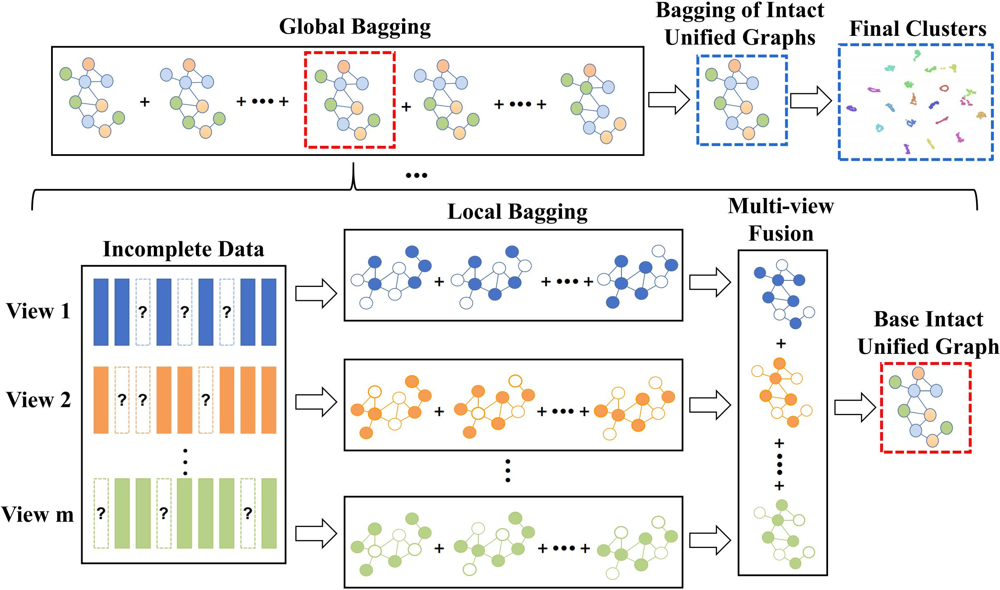

# Local and Global Bagging of Anchor-graphs for IMC

The demo code of Incomplete multi-view clustering via local and global bagging of anchor graphs.

The proposed local and global bagging anchor graphs for incomplete multi-view clustering. In this figure, the hollow circles denote the nodes of missing samples or nodes without edge weights due to the mechanism of local bagging. Notably, the local bagging process is nested inside the global bagging process and they are performed iteratively. The final clustering result is achieved by applying fast spectral clustering to the bagged intact unified anchor graph.

## Abstract

Anchor graphs are powerful tools for large-scale applications, but their quality depends on the selection of representative anchors, which is a difficult endeavor. Another challenge is to cluster data with incomplete multi-view features, which have missing values in some views. This paper proposes a novel method for incomplete multi-view clustering based on local and global aggregation of anchor graphs. Our method does not require a specific anchor selection scheme but leverages bagging techniques to decrease the variance and discover the intrinsic anchor graphs. Specifically, we first construct bagged partial anchor graphs for each incomplete view by randomly sampling anchors. Then, we integrate the bagged partial anchor graphs from multiple views into a unified and complete anchor graph. Finally, we apply global bagging to the unified anchor graph to further boost performance. Our method can generate robust anchor graphs for incomplete multi-view clustering scenarios, as evidenced by extensive experiments.

## Citation

> Ao Li, Haoyue Xu, Cong Feng, Hailu Yang, Shibiao Xu. Incomplete multi-view clustering via local global bagging of anchor graphs. Expert Systems with Applications, page 123402, 2024.

